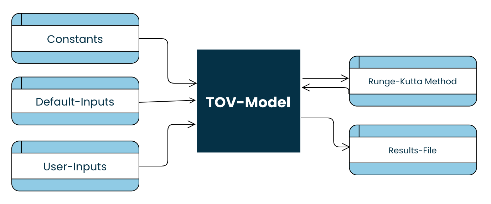
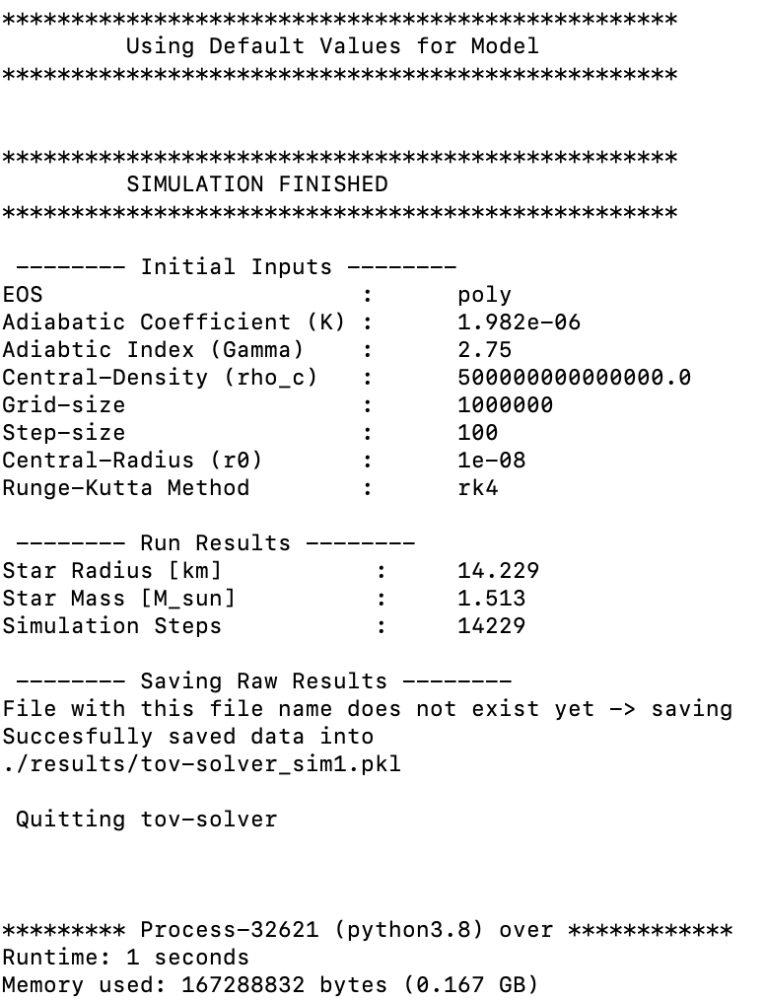
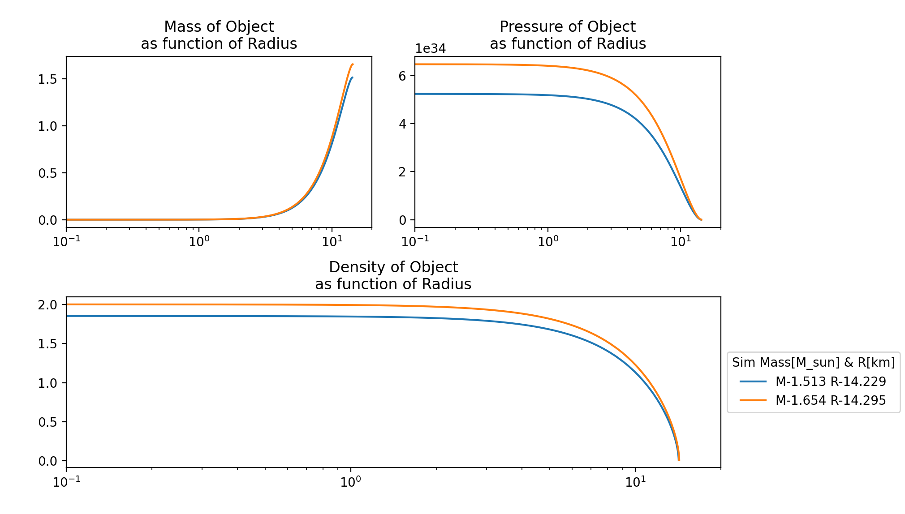

# tov-solver
Numerically solving the Tolman-Oppenheimer-Volkoff qquations to model the internal structure of neutron stars

## Useful Guides
- [Code Guide](other/TOV_CodeGuide_WickerMauritz.pdf)
- [Project Report](other/TOV_Solver_WickerMauritz.pdf)

## Code Overview

## To Run
1. Install requirements
2. Set User-Input paramters in *user_input.py*
3. Run *main.py*

## Analysis
1. Set User-Input paramters in */analysis/analysis_user_input.py*
2. Run */analysis/run_analysis.py*

## Example Output

Lecture: Numerical Techniques for Modeling Relativistic Hydrodynamics
Ruprecht Karl University of Heidelberg
Department of Physics and Astronomy
